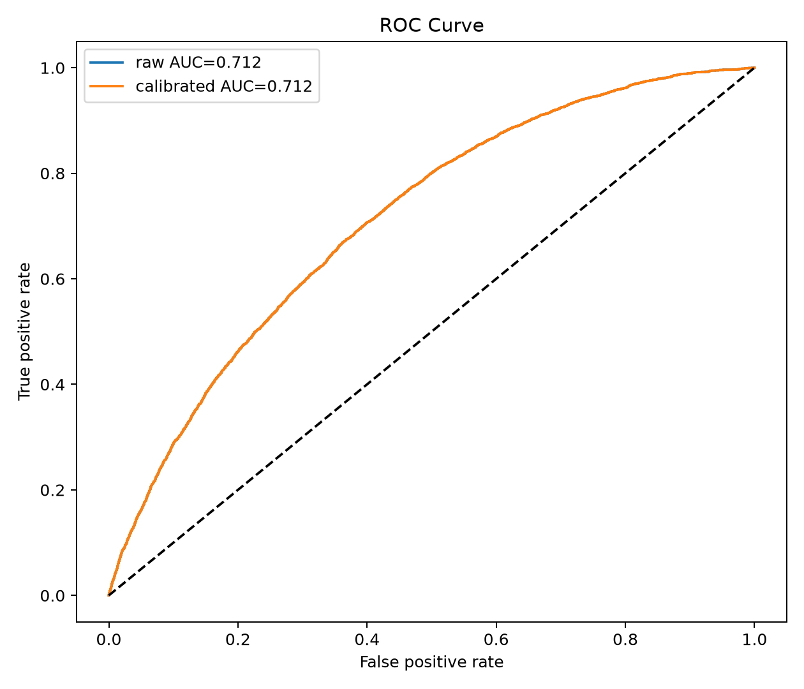
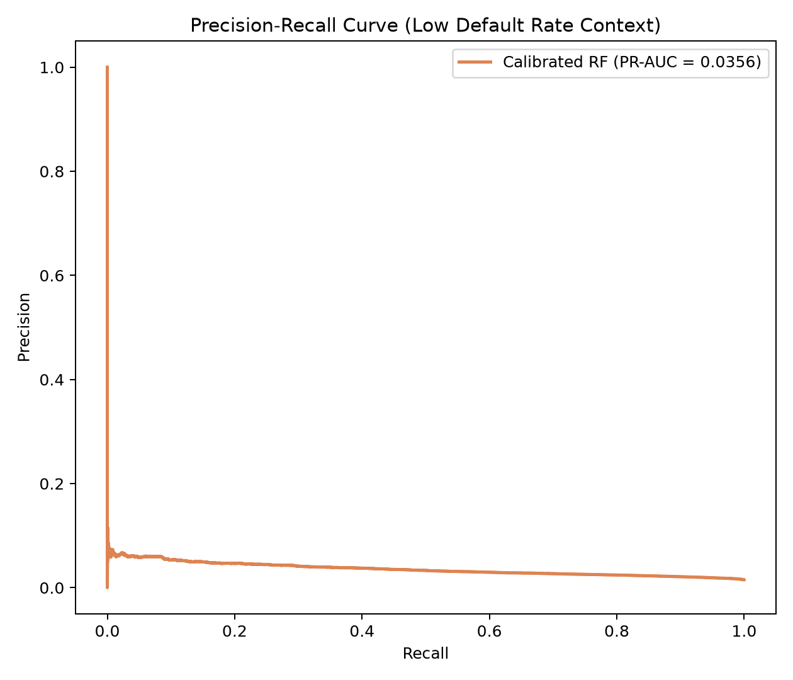
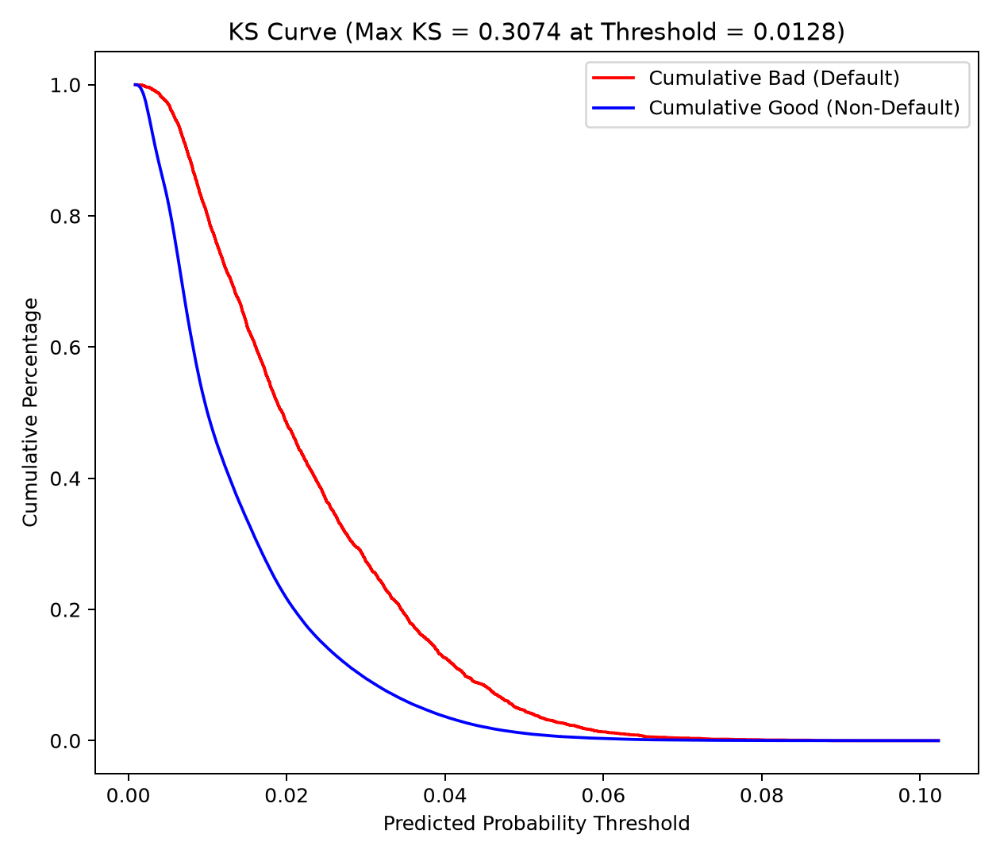
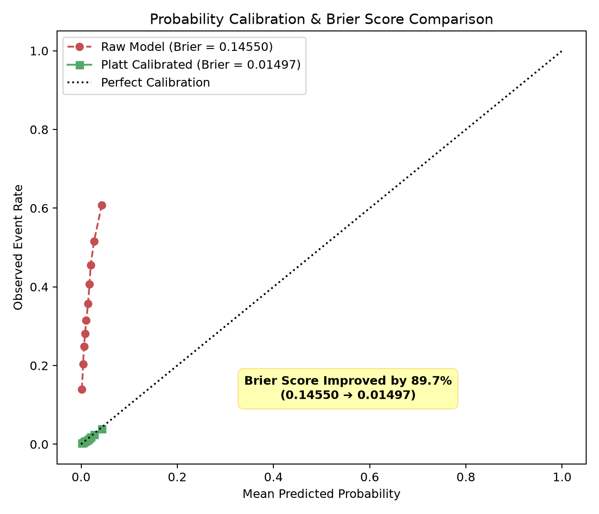
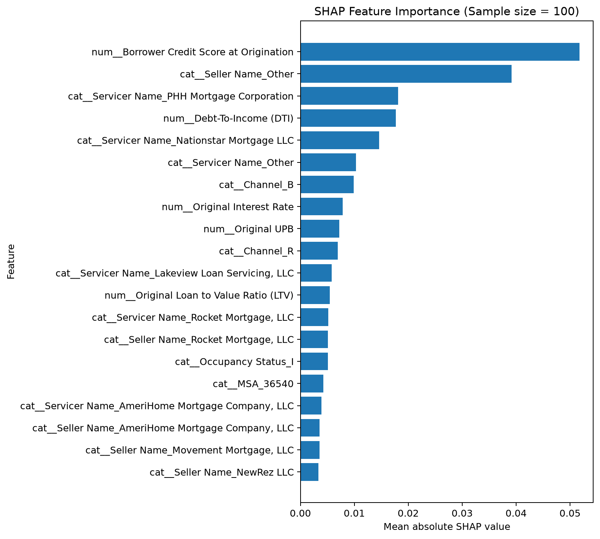
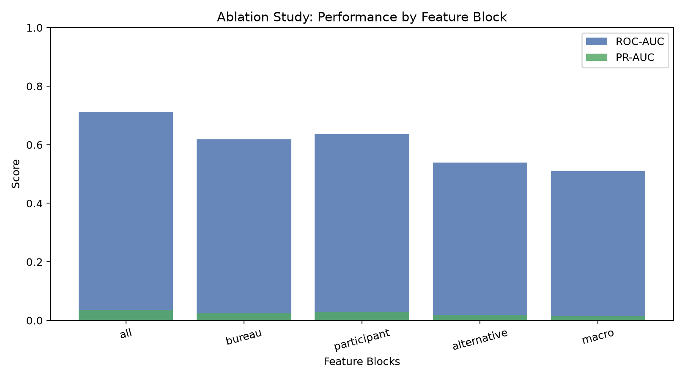
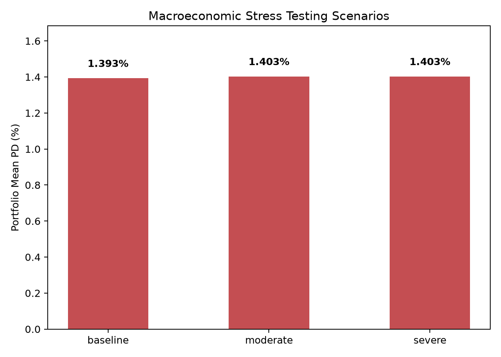

# Project Results Analysis
## 1. Abstract

This project asks a practical credit-risk question: can a model rank mortgage loans by the probability of a **new 30+ day delinquency event during the next three monthly reporting periods**, using information available at the baseline month?

The analysis compares a class-weighted logistic regression with a random forest, evaluates both models on a chronological out-of-time test window, calibrates the selected model's probabilities with Platt scaling, and then examines model drivers, feature-group contribution, population drift, and macroeconomic sensitivity.

The main result is a useful but deliberately bounded one. The random forest achieves a test ROC-AUC of **0.7121**, while the logistic regression reaches **0.7100**. The small gap means that the more complex model adds limited ranking power over a transparent linear benchmark. The calibrated model has a test Brier score of **0.01497**, versus **0.14550** before calibration, while preserving ranking metrics. In a rare-event setting with a **1.534%** test event rate, this supports a risk-ranking and monitoring use case; it does not establish a production-ready default probability, causal explanation, or loss forecast.

**The strongest professional signal in this work is the separation of ranking, probability accuracy, explanation, drift, and stress behavior.** These are different model-risk questions, and the project does not treat a single AUC number as a complete validation result.

## 2. Modeling Objective and Decision Context

The target is conditional on a loan being current at the baseline and having three consecutive future observations. It identifies whether delinquency reaches at least one month in any of the next three reporting periods. This makes the output a short-horizon **forward delinquency risk indicator**, rather than lifetime PD, charge-off probability, loss given default, or exposure at default.

The model is therefore most naturally used to support:

- prioritization of a limited review or early-warning queue;
- portfolio monitoring across origination, servicing, and collateral segments;
- comparison of model families under temporal validation;
- diagnosis of whether probability estimates remain meaningful when event prevalence is low.

The objective is not to claim that a seller, servicer, geography, or borrower attribute causes delinquency. Those variables may capture portfolio mix, operational practice, underwriting composition, vintage, or other correlated effects.

## 3. Methodology and Validation Design

The two model families serve complementary roles: logistic regression is a transparent benchmark, while random forest tests whether nonlinear interactions improve ranking. The report focuses on their empirical comparison rather than repeating their standard textbook derivations. Both models use the same feature preprocessing and the same temporal evaluation design.

### 3.1 Why temporal validation matters

Rows are split by month into chronological train, calibration/model-selection, and final test periods. This mirrors the way a credit model is actually used: it learns from earlier vintages and is evaluated on later observations. It is more informative than a random row split when portfolio composition, rates, servicing mix, and macro conditions evolve through time.

The main test window contains **263,564 observations** from October to December 2025. The event rate rises from **1.265% in January 2025 to 1.642% in December 2025**, so temporal drift is economically relevant even within this relatively short sample.

### 3.2 Why Platt scaling matters

Platt scaling fits a one-variable logistic model to the base model's log-odds:

$$
s_i = \log\left(\frac{p_i}{1 - p_i}\right),
\quad
\hat{p}_i^{\text{cal}} = \sigma(a s_i + b)
$$

When the fitted map is monotone, it changes the probability scale without changing the ordering of loans. That distinction is central here:

- ROC-AUC, PR-AUC, KS, and top-k capture evaluate ranking;
- Brier score and calibration curves evaluate probability accuracy;
- threshold metrics depend on a policy cutoff and should reflect operational capacity and costs.

**Treating calibration as a separate model-risk layer is an important strength of the project.** A model can rank risk usefully while producing probabilities that are too high or too low for decision-making.

## 4. Out-of-Time Performance

### 4.1 Core test metrics

| Test metric | Value | What it means |
|---|---:|---|
| Test observations | 263,564 | Later-period observations reserved for final evaluation |
| Event rate | 1.534% | Rare-event classification setting |
| Random forest ROC-AUC | 0.7121 | Moderate ranking discrimination |
| Logistic regression ROC-AUC | 0.7100 | Nearly tied benchmark; the simpler challenger is competitive |
| Random forest average precision | 0.0356 | Above the 0.0153 prevalence baseline, but absolute precision remains low |
| Raw Brier score | 0.14550 | Poor raw probability scale, consistent with class-weighted training |
| Calibrated Brier score | 0.01497 | Much closer to the event-rate scale and materially improved |
| Maximum KS | 0.3074 | Meaningful separation between event and non-event score distributions |

The key ranking quantities are defined as follows. With score threshold $c$, $TP(c)$, $FP(c)$, $TN(c)$, and $FN(c)$ denote the corresponding confusion-matrix counts:

$$
\text{TPR}(c) = \frac{TP(c)}{TP(c) + FN(c)},
\quad
\text{FPR}(c) = \frac{FP(c)}{FP(c) + TN(c)}
$$

ROC-AUC is the area under the ROC curve and can be interpreted as

$$
\text{AUC} = P\left(s^+ > s^-\right)
$$

the probability that a randomly selected event receives a higher score than a randomly selected non-event. Precision-recall analysis uses

$$
\text{Precision}(c) = \frac{TP(c)}{TP(c) + FP(c)},
\quad
\text{Recall}(c) = \text{TPR}(c)
$$

Average precision summarizes precision over the recall increments. For a rare event, its no-skill reference is the event prevalence, so it is more decision-relevant than ROC-AUC alone.

### 4.2 ROC and precision-recall interpretation

The ROC plot shows that the forest has only a small advantage over logistic regression. The result supports a disciplined conclusion: **nonlinearity is useful, but the evidence does not justify claiming that the complex model decisively outperforms the transparent baseline**.

The PR curve is more informative than ROC-AUC in this setting because delinquency is rare. Average precision of **0.0356** is roughly 2.3 times the observed event prevalence, which indicates ranking lift. It is still a low absolute precision level, so a high score should be interpreted as “higher relative risk” rather than “likely to default.”

### 4.3 Ranking capture and operational capacity

| Review capacity | Share of all events captured | Random-selection reference |
|---:|---:|---:|
| Top 1% | 3.93% | 1.00% |
| Top 5% | 15.78% | 5.00% |
| Top 10% | 28.04% | 10.00% |

For a score threshold $c$, the Kolmogorov-Smirnov statistic is

$$
\text{KS} = \max_c \left|F_1(c) - F_0(c)\right|
$$

where $F_1$ and $F_0$ are the cumulative score distributions for events and non-events. For a review capacity $k$, top-k capture is

$$
\text{TopKCap} = \frac{\text{count}(\text{events in highest-scored } k\\% )}{\text{count}(\text{all events})}
$$

Top-k capture is directly connected to a constrained operating process. Reviewing the highest-scored 10% captures about **2.8 times** the event share expected under random selection. This is a more credible use case than a fixed 0.5 classification threshold because a collections, underwriting, or monitoring team usually has a finite review capacity.

The saved 0.5-threshold results should not be used as the main business conclusion. The calibrated model has no scores above 0.5, so precision, recall, and F1 are zero at that cutoff. The raw model reports 3.70% precision and 41.30% recall, but its raw Brier score shows that this threshold is being applied to a poorly calibrated probability scale. A real decision threshold should be selected on a validation period using capacity, false-positive cost, missed-event cost, and expected-loss economics.

## 5. Probability Calibration

The calibration result is the clearest evidence that ranking and probability estimation are separate problems. Platt scaling reduces the Brier score from **0.14550 to 0.01497** without changing ROC-AUC, KS, or top-k capture. This is consistent with a monotone probability remapping: the loans retain their ordering, while the predicted probabilities become closer to observed frequencies.

For observations $(y_i, p_i)$, where $y_i \in \{0, 1\}$ and $p_i$ is the predicted event probability, the Brier score is

$$
\text{Brier} = \frac{1}{n} \sum_{i=1}^{n} (p_i - y_i)^2
$$

Lower values are better, but Brier score combines calibration and refinement. A calibration curve groups predictions into probability bins and compares the mean predicted probability with the observed event frequency in each bin.

The improvement is substantial, but it should not be oversold. The calibration partition is also used for model-family selection, and it covers only two months. A stronger design would select the model and fit the calibration map on distinct rolling-origin windows, then evaluate calibration on a later untouched period.

## 6. Model Explainability and Professional Insight

The mean absolute SHAP ranking identifies the variables that move the forest prediction most strongly on the transformed model scale:

For a model output $f(x)$, SHAP decomposes the prediction relative to a background expectation:

$$
f(x) = \phi_0 + \sum_{j=1}^{M} \phi_j
$$

where $\phi_0$ is the expected model output and $\phi_j$ is feature $j$'s contribution for that observation. The global importance reported here is

$$
I_j = \frac{1}{n} \sum_{i=1}^{n} |\phi_{ij}|
$$

This is a magnitude measure. It does not by itself indicate direction, causality, fairness, or stability across populations.

| Leading signal | Mean absolute SHAP | Interpretation |
|---|---:|---|
| Borrower credit score at origination | 0.0517 | Strongest individual predictive signal in this sample |
| Seller Name = Other | 0.0392 | Institutional/portfolio category with substantial predictive association |
| Servicer Name = PHH Mortgage Corporation | 0.0181 | Servicing category contributes materially to model variation |
| DTI | 0.0177 | Borrower debt burden remains an important risk signal |
| Servicer Name = Nationstar Mortgage LLC | 0.0146 | Another strong institutional category signal |

The result is professionally useful because it does not stop at “credit score matters.” It shows that **institutional categories are important enough to require governance attention**. Their importance may reflect underwriting composition, servicing practices, geographic concentration, vintage, or data artifacts. SHAP magnitude does not show direction or causality, and correlated seller/servicer categories can split the same underlying signal across several variables.

The SHAP calculation uses a random sample of 100 test observations. That is suitable for an exploratory portfolio explanation, but not enough to establish stable global importance rankings. A production review should add a reproducible larger sample, SHAP dependence plots, local explanations, and stability comparisons across time and segments.

## 7. Feature-Block Ablation

| Feature block | ROC-AUC | Average precision | Raw Brier |
|---|---:|---:|---:|
| All blocks | 0.7121 | 0.0356 | 0.1455 |
| Bureau | 0.6179 | 0.0261 | 0.0382 |
| Participant | 0.6355 | 0.0280 | 0.2376 |
| Alternative | 0.5395 | 0.0180 | 0.2278 |
| Macro | 0.5104 | 0.0156 | 0.2465 |

The full feature set performs best, which supports the value of combining heterogeneous information. The Participant block alone outperforms the bureau block on ROC-AUC, an important diagnostic finding rather than a causal conclusion. It suggests that seller, servicer, and channel categories may encode portfolio or process composition that is highly predictive in this sample.

For feature block $g$, the ablation effect can be summarized as

$$
\Delta_g = \text{Metric}(X_{\text{all}}) - \text{Metric}(X_g)
$$

where $X_g$ contains only the variables in block $g$. This is a standalone block comparison, not a conditional contribution after controlling for every other block.

The alternative block is only slightly above chance, and the macro block is close to chance on its own. That does not prove that macro variables have no incremental value in the full model; a one-block-at-a-time ablation cannot measure conditional contribution after other blocks are present.

The Brier values in this table are from uncalibrated comparison runs. They should not be compared directly with the calibrated main-model Brier as if they were the same probability product. The figure also overlays ROC-AUC and average precision, which are on very different scales; a two-panel or separately scaled chart would make the PR-AUC differences easier to read.

## 8. Drift Monitoring

The PSI report shows three distinct levels of population change:

For reference-bin proportions $p_j$ and monitoring-bin proportions $q_j$, the population stability index is

$$
\text{PSI} = \sum_{j=1}^{J} (q_j - p_j) \ln\left(\frac{q_j}{p_j}\right)
$$

The formula should include explicit bins for missing values, underflow, and overflow. PSI is a distribution-shift diagnostic, not a direct measure of discrimination, calibration, or causality.

| Signal | PSI | Reading |
|---|---:|---|
| Original interest rate | 0.7415 | Large train/test shift |
| Seller Name | 0.1434 | Moderate shift |
| Servicer Name | 0.1242 | Moderate shift |
| MSA | 0.0427 | Smaller shift under the project's threshold |
| Other major numeric/categorical fields | 0.0000-0.0115 | Relatively stable |

The large interest-rate shift is a meaningful model-risk signal. It can represent a change in origination vintage or market regime, and the variable is also among the model's predictive inputs. Seller and servicer movement matters because the SHAP results show that institutional categories are influential. **The correct response is segment-level performance and calibration review, not an automatic claim that the model has failed.**

The saved `target_distribution` PSI of zero should not be presented as evidence that event prevalence is stable. It was calculated incorrectly on the full modeling sample rather than as a train-only reference versus a test-only target distribution. The monthly event rate increases from 1.265% to 1.642%, which reinforces the need to correct this diagnostic before using it in model monitoring.

The current numeric PSI implementation also needs explicit missing, underflow, and overflow bins. Otherwise, test values outside the reference range can be excluded from the binned comparison.

## 9. Macroeconomic Stress Interpretation

| Scenario | Mean calibrated PD | Median calibrated PD |
|---|---:|---:|
| Baseline | 1.3926% | 1.0113% |
| Moderate shock | 1.4028% | 1.0161% |
| Severe shock | 1.4028% | 1.0161% |

The stress module applies progressively larger shocks to the Treasury yield, VIX, and trailing SPY return. The average PD moves only slightly, and the severe scenario is exactly equal to the moderate scenario in the saved output.

For scenario $s$ and loan $i$, the stress effect is

$$
\Delta p_i^{(s)} = p_i^{(s)} - p_i^{(0)},
\quad
\Delta\bar{p}^{(s)} = \frac{1}{n} \sum_{i=1}^{n} \Delta p_i^{(s)}
$$

where $p_i^{(0)}$ is the baseline probability and $p_i^{(s)}$ is the probability after applying the scenario shock. A useful stress review should inspect both the portfolio average and the distribution of individual $\Delta p_i^{(s)}$, including monotonicity and segment concentration.

This flat response is a diagnostic warning, not evidence of resilience. Possible explanations include weak macro dependence, the forest's limited extrapolation outside its training range, probability clipping or calibration saturation, or a defect in the stress-test data flow. A credible stress framework should inspect per-loan PD changes, monotonicity, segment contributions, extrapolation beyond training ranges, and agreement across model families. The scenarios should be described as sensitivity tests, not forecasts or historical crisis reconstructions.

## 10. Innovation
The most important innovation is fusing **four heterogeneous feature families** (Bureau, participant, alternative, macro) into one **explainable risk scoring framework** with leakage aware temporal design and point in time macro alignment.

Rather than treating the model as a black box judged by AUC alone, the project keeps the whole pipeline auditable: a **transparent logistic challenger** benchmarks the forest, **calibration** separates ranking from probability semantics, rare event performance uses PR AUC, KS, top k and Brier jointly, and SHAP, ablation, PSI drift and stress tests tie what the model relies on to governance questions.
